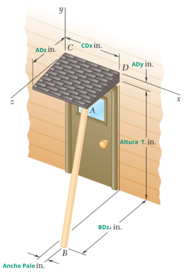

# 📐 Proyecto Final – Mecánica Estática

## 🎓 Universidad del Valle de Guatemala  
**Campus Sur – Facultad de Ingeniería**  
Curso: *Mecánica Estática*  
**Catedrático: Ing. Ángel Santos Rivera**

---

### 👥 Integrantes del grupo
- **Esteban Rivas** – 23703  
- **Claudia Gómez** – 23701  
- **Eduar Hidalgo** – 231473
- **Noé Ramírez** – 231626


---

## 🧠 Descripción

Este proyecto resuelve el **Ejercicio 3.24** del libro *Mecánica Vectorial para Ingenieros*, en el que se analiza un sistema estructural donde una fuerza de 57 lb actúa a lo largo del puntal **AB**, generando un **momento respecto al punto C**.

Incluye:

- Cálculo del vector de fuerza en 3D.
- Momento de la fuerza mediante producto cruzado.
- Visualización 3D interactiva del sistema.
- Parámetros dinámicos para simular diferentes configuraciones.
- Imagen del enunciado para mayor comprensión visual.

---

## 📸 Visualización

<div align="center">
  
</div>

---

## 🚀 Cómo ejecutar

1. Clona o descarga este repositorio:
   ```bash
   git clone https://github.com/tu_usuario/proyecto-mecanica.git
   cd proyecto-mecanica
   ```

2. (Opcional) Crea un entorno virtual:
   ```bash
   python -m venv venv
   source venv/bin/activate  # o venv\Scripts\activate en Windows
   ```

3. Instala las dependencias necesarias:
   ```bash
   pip install -r requirements.txt
   ```

4. Ejecuta el sistema en tu navegador:
   ```bash
   streamlit run main.py
   ```

---

## 🛠️ Tecnologías utilizadas

- `Streamlit` – para la interfaz interactiva
- `Plotly` – para el gráfico 3D
- `NumPy` – para operaciones vectoriales
- `Pillow` – para cargar imágenes

---

## 🧮 Fundamento teórico

Se aplica el concepto de **momento vectorial** en el espacio tridimensional:

\[
\vec{M}_C = \vec{r}_{CA} \times \vec{F}
\]

Donde:
- $\vec{F}$ es el vector de fuerza que va desde A hacia B.
- $\vec{r}_{CA}$ es el vector desde el punto C hasta A.
- El resultado es el momento con respecto al punto C.

---

## 📌 Notas

Este simulador **no calcula las reacciones estructurales completas**, ya que no se tiene información sobre apoyos ni condiciones de carga adicionales. El objetivo es educativo, enfocado en análisis vectorial y visualización espacial del momento.

---

> *Proyecto final presentado como parte del curso de Mecánica Estática – UVG Campus Sur, 2025.*
